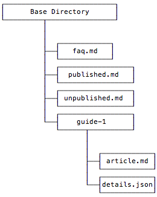

============================
Layout of content repository
============================

The CMS expects a specific layout for the content repository, but you don't
have to create the structure manually.  You can start with an empty repository
and the structure will fill itself out as guides are added.  However, it's
useful to understand how the content repository is structured and there are
a few 'static' pages you have to create yourself.  Below isthe basic layout
from a high-level view.  You can also see a working example
`here <http://github.com/pluralsight/guides>`_.

-----------------
Layout components
-----------------

The layout consists of a the following 'types' of files/objects:

^^^^
Page
^^^^

A page is just a markdown file at the top-level of the repository.  Currently
there's one page being used called `faq.md`.  The markdown for this page will
automatically be rendered at the `/faq.md` URL.

^^^^^^^^^^^^^
Guide Listing
^^^^^^^^^^^^^

The guide listing files are meant to be an easy way to reading the listing of
published and unpublished or 'in-review' guides.  These files make it much
faster to render the contents of the `/` and `/review/` URLs.  Currently there
is no other persistent storage other than the Github repository.  So, these
files aggregate the base-essentials of a list of guides into a single file.
This way listing guides only results in 1 Github API call instead of several to
search the entire repository.

The two listing files currently used are `published.md` for the listing of
published files appearing on the homepage and `unpublished.md` for the listing
of files appearing on the `/review/` page.

Listing file structure
^^^^^^^^^^^^^^^^^^^^^^

^^^^^^^^^^^^^^^
Guide directory
^^^^^^^^^^^^^^^

A guide consists of a directory named after the 'slug-ifed' version of the
guide title.  This directory consists of two files, 1 for the content and 1 for
the metadata.

^^^^^^^^^^
article.md
^^^^^^^^^^

This file is the raw content in the [markdown](http://daringfireball.net/projects/markdown/) format.

^^^^^^^^^^^^
details.json
^^^^^^^^^^^^

This is the metadata for the guide in the [json format](https://en.wikipedia.org/wiki/JSON).  We chose JSON because it's fairly readable and easy to use with lots of languages.

Why two files?
^^^^^^^^^^^^^^

Metadata is necessary for computers, not for humans.  We want guide data to
easily render great everywhere including the CMS front-end, Github.com, and
even in your own text editor.  This isn't very easy to achieve if you have to
hide your metadata somewhere in the same file.

Another bonus is we can modify the metadata indpendently of the content.  This
allows for easier reading of the history for the most important part of the
guide, the content.

--------
Branches
--------

Branches are currently used for suggested 'edits' to guides by the community
editors.  The branches are named after the github login name of the user whose
edits triggered the creation.

Each time a user edits an existing users' guide a branch is created (or
updated).  You can easily use `Github's compare functionality <https://github.com/blog/612-introducing-github-compare-view>`_ to see the edits a particular user is suggesting.

You can try out the compare feature by going `here <https://github.com/pluralsight/guides/compare/>`_.  You can also append a login name to the end of this url `https://github.com/pluralsight/guides/compare/` to see that users' suggestions.

^^^^^^^^^^^^^^
Why not forks?
^^^^^^^^^^^^^^

Forks are great, but we decided to use branches for tracking user suggestions.
We're pushing for simplicity from the start so using branches is definitely an
experiment.  However, there are several benefits of using branches instead of
forks:

Pros of branches
^^^^^^^^^^^^^^^^

* Creating branches is synchronous via the Github API.
    * Forks via the Github API is asynchronous. Doing anything asynchronous is
      more difficult because it requires a queue, etc.
* Prevents forking potentially large repository of unrelated guides to users'
  account
    * Editors will most likely be editing a single guide at a time. So, it's
      seems overkill to fork a repository full of guides when the user is only
      trying to edit one.
* Ideally we'd like to request as few permissions from users' github accounts
  as possible.  Forking requires the 'public_repo' `scope <https://developer.github.com/v3/oauth/#scopes>`_.  However, we can create branches using our own repository and add the user as the 'commit author' on the changes.  This workflow doesn't require the 'public_repo' scope.
    *Currently we're requesting the 'public_repo' scope because that enables us
    to star public repositories, which we anticipate using.  So, this point is
    somewhat irrelevant.  However, it's something to consider regardless.*

Ultimately we can move to use forking in the future if branching becomes
limited or poses problems that forking would solve.  Again, the major driver
here is simplicity.

^^^^^^^^^^^^^^
Why not Gists?
^^^^^^^^^^^^^^

We heavily considered using `Github gists <https://gist.github.com>`_ for the
guides.  However, it's not possible to create gist for one user in another
users' account.  The CMS github user cannot create a gist in a single gist
account **and** maintain the original author.

This is a problem because we're striving to give all credit to original authors
and editors when making changes via the Github API.  This allows any
contributions users to flow back to their account.  This means every change
your make to a guide counts towards you total `Github contributions <https://help.github.com/articles/viewing-contributions-on-your-profile-page/>`_.

The other issue with gists is tracking.  We could solve the contribution
problem by creating gists in every users' account.  However, then the CMS would
need external persistent storage to track all the gists.  Also, users would not
be able to easily browse all the guides in a single location on github.com.
